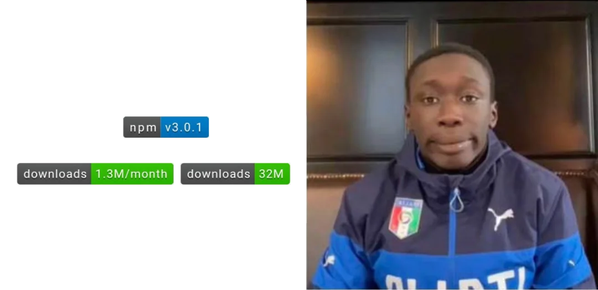
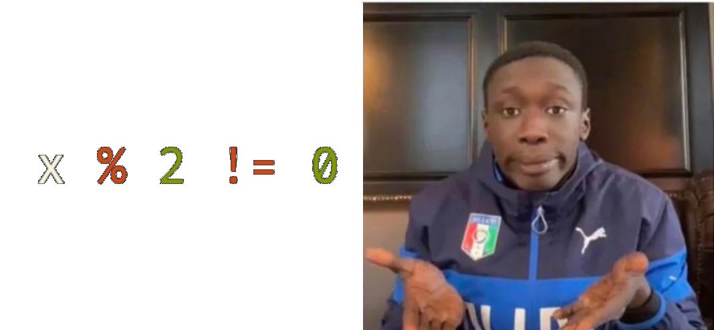

# *isOdd.lua*

*Is this number odd??*

## Contents
- [Overview](#overview)

## Overview
isOdd.lua is very simple to use library that tackles the
very *daunting* and *complex* task of determining wether a
number is even or not.

> [!NOTE]
> Yes, this is a shitpost.
>
> We here poke fun at everything.

[Wtf.js](https://github.com/denysdovhan/wtfjs) might have an explanation to this.
Just witness the [Funny math](https://github.com/denysdovhan/wtfjs#funny-math) section.

This is what happens when a programming language tries to suit everyone and generally fails miserably.

Absolutely no one but JavaScript:

Everyone else:

